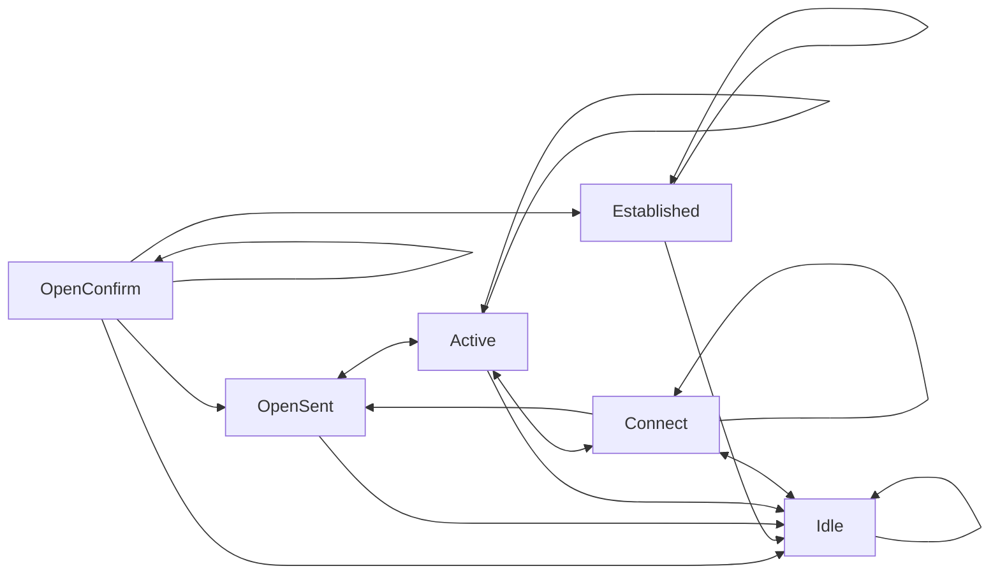

Pages are formatted using [MkDocs Markdown](https://www.mkdocs.org/user-guide/writing-your-docs/#writing-with-markdown)

We use some [markdown extensions](https://squidfunk.github.io/mkdocs-material/reference/) to structure our content.

### Tabs

```md
=== "Tab 1"

    Lorem ipsum dolor sit amet, consectetur adipiscing elit.

=== "Tab 1"

    Ut enim ad minim veniam, quis nostrud exercitation ullamco.
```

=== "Tab 1"

    Lorem ipsum dolor sit amet, consectetur adipiscing elit.

=== "Tab 1"

    Ut enim ad minim veniam, quis nostrud exercitation ullamco.

---

### Note/Warning

!!! note
    This is a note

```md
!!! note
    This is a note
```

---

!!! warning
    This is a warning

```md
!!! warning
    This is a warning
```

---

### Diagrams

Diagrams use [Mermaid](https://mermaid.js.org/intro/) syntax



```md
 ```mermaid
 graph LR
   A[Start] --> B{Error?};
   B -->|Yes| C[Hmm...];
   C --> D[Debug];
   D --> B;
   B ---->|No| E[Yay!];
 ```

```

---

### Footnotes

Lorem Ipsum[^1]

[^1]: Lorem ipsum dolor sit amet, consectetur adipiscing elit.

```md
[^1]: Lorem ipsum dolor sit amet, consectetur adipiscing elit.
```
