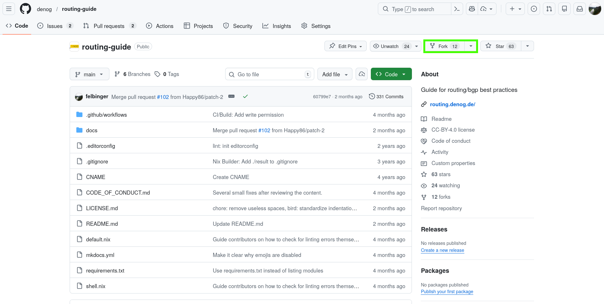
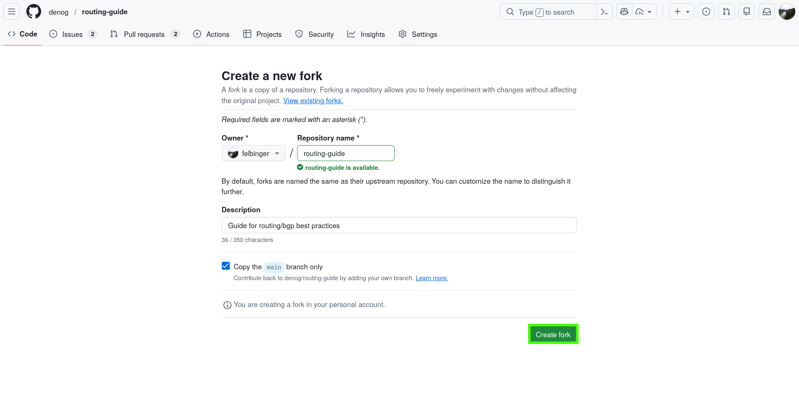
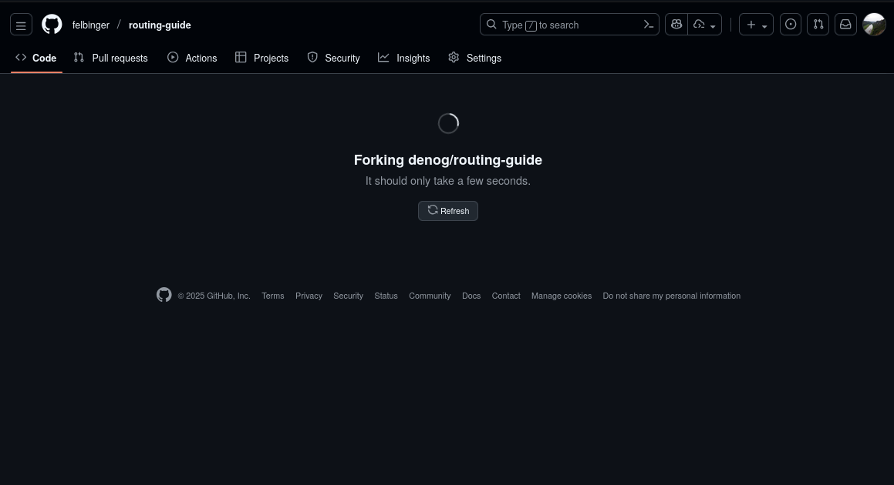
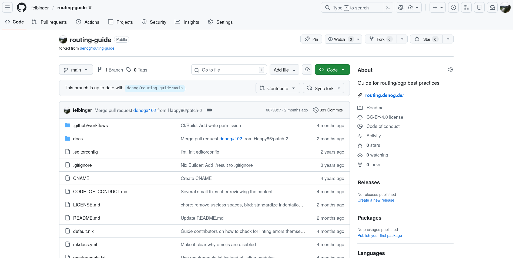
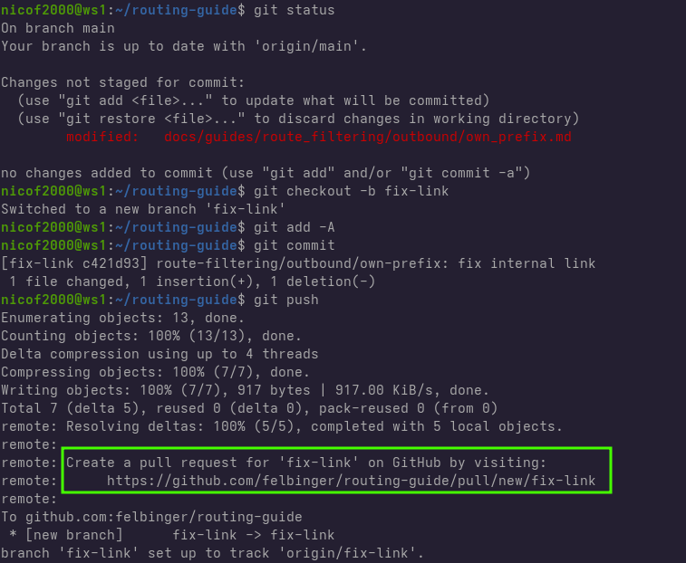

# DENOG Contributions

Here we document various things

- Contribution guide (Credits, Maintainer and sources)
    - [Issue forms](https://docs.github.com/en/communities/using-templates-to-encourage-useful-issues-and-pull-requests/configuring-issue-templates-for-your-repository)
    - [pull request template](https://docs.github.com/en/communities/using-templates-to-encourage-useful-issues-and-pull-requests/creating-a-pull-request-template-for-your-repository)
    - Other sources (like NLNOG BGP Guide)
    - Maintainer
    - Credits to WG Runners

## How to git
1. **Fork repository**

    If you're an external contributor (not a maintainer of the DENOG Routing Working Group),
    start by forking the repository on GitHub.

    <!-- render two images next to each other in one row -->
    { width=50% }{ width=50% }
    { width=50% }{ width=50% }

2. **Clone repository**

    Next clone the repository to your local machine.

    Working locally allows you to test your changes before submitting them.

    <!-- TODO think about using spoiler -->
    !!! info "Alternative: github.dev web-based editor"
        You can also use the [github.dev web-based editor](https://docs.github.com/en/codespaces/the-githubdev-web-based-editor)
        directly in your browser.

        This is convenient for small edits or typo fixes:
        Simply press the . (dot) key on the repository page or navigate to
        `https://github.dev/<your-username>/routing-guide` to open it.

        However, please note that you cannot fully test your changes in this environment
        (e. g. `mkdocs serve` and `.editorconfig` validation are not available).

        You can still preview your changes in the GitHub interface after creating a pull
        request, but for anything beyond minor edits, we strongly recommend using local tools.

        

    === "Command Line"
        ```
        git clone https://github.com/<your-username>/routing-guide.git
        cd routing-guide
        ```

    <!-- TODO vscode and other gui tools -->

3. **Checkout a new branch**

    Always create a new branch for your work before making any changes.

    Working on a dedicated branch helps keep your main branch clean and allows
    reviewers to make adjustments directly within your branch if needed.

    !!! note
         GitHub does not allow maintainers to make changes on the main branch of the fork.

         More details can be found here: <https://docs.github.com/en/pull-requests/collaborating-with-pull-requests/working-with-forks/allowing-changes-to-a-pull-request-branch-created-from-a-fork>

    === "Command Line"
        ```
        git checkout -b <branch-name>
        ```

    <!-- TODO vscode and other gui tools -->

4. **Make your changes**

    Edit or add files as needed.
    Follow the style and structure of the existing content in the guide.

5. **Test changes**

    <!-- TODO python installation ? out of scope of this guide? -->

    If this is your first contribution, you’ll need to install a few tools to
    build and validate the documentation locally.

    Install the required dependencies:
    ```
    pip3 install -r requirements.txt
    pip3 install editorconfig-checker
    ```

    Once installed, you can lint the repository files and preview your changes:

    - To check formatting and coding style, run `ec`.
    - To render the documentation and verify that it builds correctly, run `mkdocs serve`.

    This command starts a local web server, where you can review your changes in your browser.

    !!! info "Tip"
        Please review your edits carefully to ensure that formatting, links, and layout
        appear as expected before proceeding to commit and push your changes.

6. **Commit changes**

    Once you’ve verified that your edits look correct, it’s time to add and commit
    them to your branch.

    !!! info "Tip"
        - Keep your commit messages short but meaningful: they should explain what you
          changed and, if relevant, why.
        - If you are making multiple unrelated edits, consider splitting them into
          separate commits.
        - You can review your staged files before committing using `git status` or
          `git diff --cached`.

        Committing often and with clear messages helps maintain a clean history and
        makes it easier for reviewers to understand your contribution.

    === "Command Line"
        ```
        git add -A
        git commit
        ```

    <!-- TODO vscode and other gui tools -->

7. **Push and create pull request**

    Finally you can push the commits to your fork and create a pull request.

    ```
    git push origin <branch-name>
    ```

    After pushing your changes for the first time, git will show you a link to create the pull request.
    

    Alternativly you can navigate to your fork on GitHub and click on compare & pull request.
    <!-- TODO add image -->

    <!-- TODO create pr template, so this information is included in the pr itself -->

    Provide a short description of what you changed and why.

    Maintainers will review your PR, suggest changes if necessary, and merge it once approved.

<!-- TODO update pr by rebase to keep it in mergeable state -> how to resolve merge conflicts -->
